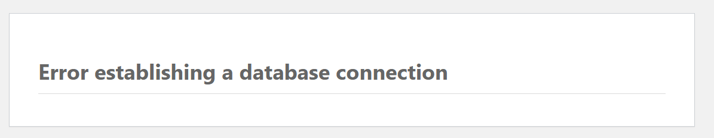
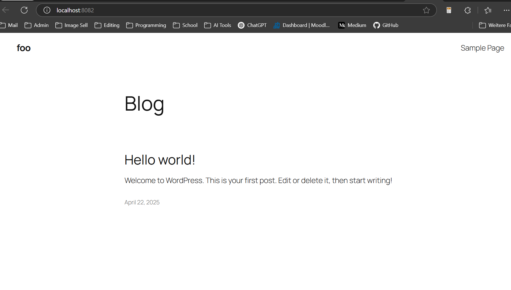
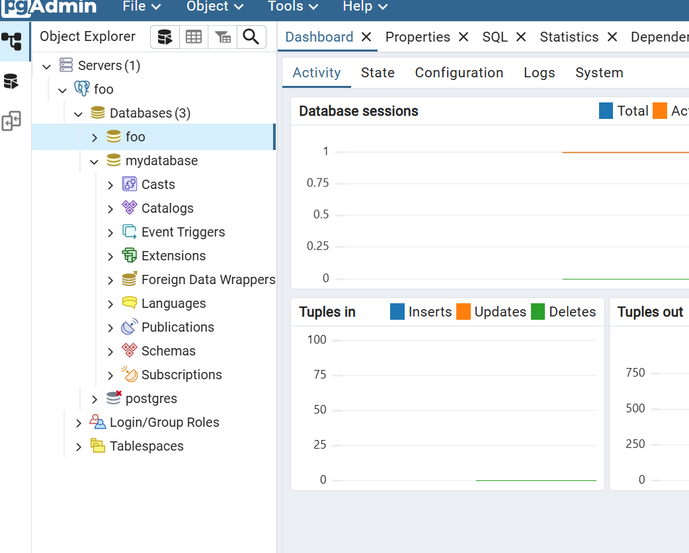
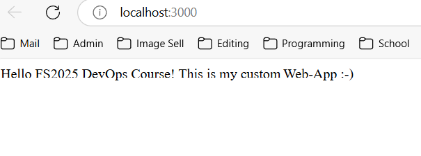
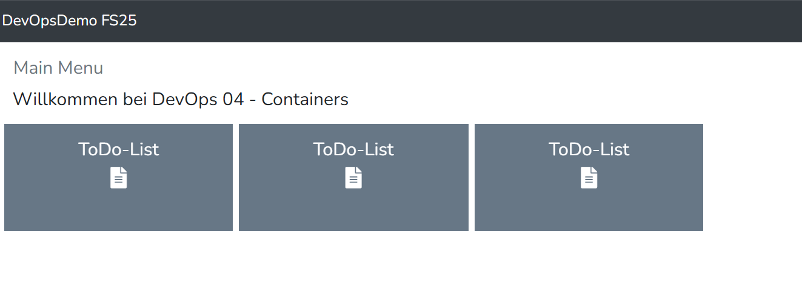

# DevOps 04 Containers

### Verwendete Images

| Docker Hub URL | Kurzbeschreibung
| ------- | ------- |
| https://hub.docker.com/r/dpage/pgadmin4 | Admin Interface für Postgres-SQL Datenbanken |
| https://hub.docker.com/_/postgres | Offizielle postgres image für eine Postgres SQL-Datenbank |

Für jedes Image eine Zeile in der Tabelle verwenden.

### Compose-File

[Link zu Docker Compose File in diesem Repository](./container-app/docker-compose.yaml)

## Eigenes Lernjournal

### 2 Applikation Docker manuell

Manuelles Deployment und Netzwerk mit Docker (Dokumentation des Erstellungsprozesses und der 
lauffähigen Applikation mit und ohne Netzwerk)

Für die folgende Demo von zwei Container-Apps übernehme ich das Beispiel mit Wordpress und einer My-SQL Datenbank. Für diesen Case wurden folgende Container verwendet:
- `mysql:9.1.0`
- `wordpress:6.7.0-php8.3`

Zum Starten Container habe ich folgende Befehle über Power-Shell verwendet. Einmal für die SQL Datenbank:
```shell
docker run --name local-mysql -e MYSQL_ROOT_PASSWORD=12345 -e MYSQL_DATABASE=wordpress -e MYSQL_USER=wordpress -e MYSQL_PASSWORD=wordpress -v mysql-data:/var/lib/mysql -d mysql:9.1.0
``` 
und einmal für den Wordpress Container:
```shell
docker run --name local-wordpress -p 8082:80 -v wordpress-data:/var/www/html -d wordpress:6.7.0-php8.3 
``` 

Danach habe ich ein Netzwerk innerhalb von Docker erstellt, was die Kommunikation zwischen den Containern ermöglicht. Mit folgendem Befehlen konnte ich dies realisieren:

Erstellung des Netzwerks in Docker:
```shell
docker network create wordpress-network 
``` 

Verbindung des MySQL-Containers mit Netzwerk 
```shell
docker network connect wordpress-network local-mysql
``` 
Dann als ich die Page über den Localhost:8082 aufrufen wollte, erhielt ich diesen Fehler:



Danach habe ich folgenden Befehl ausgeführt zur Verbindung des Wordpress-Containers mit Netzwerk:
```shell
docker network connect wordpress-network local-wordpress
``` 



Danach habe ich folgenden Output erhalten. Ich hatte die DB bereits vorher einmal mit verbundne mit dem Wordpress-Container, deshalb musste ich dies nicht mehr machen.


### Docker-Compose mit 2 Applikationen

Für die Applikation habe ich PGAdmin (Postgres SQL Interface) und eine PostgresSQL Datenbank gewählt.

Folgendes ist das Docker-Compose File:

```yaml
version: '3.8'

services:
  postgres:
    image: postgres
    container_name: postgres_db
    restart: always
    environment:
      POSTGRES_USER: admin
      POSTGRES_PASSWORD: admin
      POSTGRES_DB: mydatabase
    ports:
      - "5432:5432"
    volumes:
      - postgres_data:/var/lib/postgresql/data

  pgadmin:
    image: dpage/pgadmin4
    container_name: pgadmin
    restart: always
    environment:
      PGADMIN_DEFAULT_EMAIL: admin@admin.com
      PGADMIN_DEFAULT_PASSWORD: admin
    ports:
      - "5050:80"
    depends_on:
      - postgres

volumes:
  postgres_data: {}
```
Mit dem CMD `docker compose up` habe ich das Docker Compose File ausgeführt. Dies hat mir alle definierten Images vom DockerHub gezogen. Danach konnte ich in Docker Desktop eine Orchestrierte Anwendung sehen. Über den Port `127.0.0.1:5050` (Localhost) konnte ich auf PGAdmin zugreifen. So hat das ganze ausgesehen mitsamt der Verbindung auf die DB `mydatabase`.




## Custom Node Express App

Analoges Vorgehen zu Folien. Neuer Unterordner erstellt `node-express-webapp` dann ergänzt mit `Dockerfile`, `package.json` und `server.js`. Letzteres wurde angepasst mit einem individuellen String.

Danach Dockerfile gebuildet mit folgendem Befehl.
```bash
docker build -t simsta1/node-web-app .
```

Danach Image gestartet mit folgendem Befehl:
```bash
docker run -p 3000:3001 -d --name expressapp2 simsta1/node-web-app
```

Folgendes war der Output auf `Localhost:3000`




## DevopsDemo Eigene App

Für diesen Fall habe ich das gesamte Repo in diesen geclonet. Nachher habe ich `model.json` den Titel angepasst, sowie auch 3 Kästchen für "ToDo-List" Liste eingefügt.

Sieh Code snippet hier:
```json
elementList": [
                    {
                        "type": "pageLabel",
                        "value": "<h4>Willkommen bei DevOps 04 - Containers </h4>",
                        "newRow": true
                    },
                    {
                        "type": "button",
                        "name": { "default": "ToDo-List"
                        },
                        "icon": "fa-file-alt",
                        "color": "wet-asphalt",
                        "page": "toDoPage",
                        "width": 2,
                        "newRow": true
                    },
                    {
                        "type": "button",
                        "name": { "default": "ToDo-List"
                        },
                        "icon": "fa-file-alt",
                        "color": "wet-asphalt",
                        "page": "toDoPage",
                        "width": 2,
                        "newRow": false
                    },
                    {
                        "type": "button",
                        "name": { "default": "ToDo-List"
                        },
                        "icon": "fa-file-alt",
                        "color": "wet-asphalt",
                        "page": "toDoPage",
                        "width": 2,
                        "newRow": false
                    }
                ]
```

Danach habe ich das Image gebuildet mit dem Befehl 

```bash
docker build -t devops/devopos-demo-containers
```

Nach erfolgreichem Build habe ich das Image dann in einem Container gestartet: 
```bash
docker run -p 9001:8080 --name dockerize-devopsdemo -v devopsdemo:/usr/src/app -d devops/devopos-demo-containers
```

Folgend sah der Output aus:


